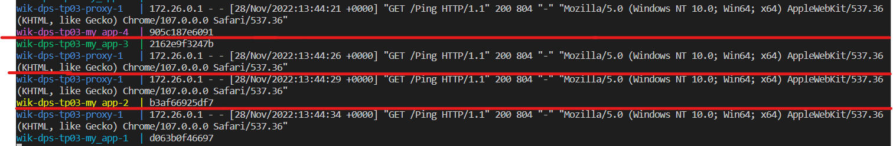

# WIK-DPS-TP03 | MONTAGNIER Yrlan

## Créer un docker-compose avec pour seul service un container basé sur le Dockerfile créé dans le TP WIK-DPS-TP02
Voir :file_folder: [``docker-compose.yaml``](./docker-compose.yaml)

## Augmenter le nombre de réplicas à 4 pour ce service
Cela se fait dans le docker-compose.yaml grâce aux lignes 
```
deploy:
    mode: replicated
    replicas: 4 # On déploie 4 fois le container au sein du service my_app
```
Cela permet d'avoir 4 instances de notre application, le load balancer du serveur Nginx permettra de rediriger les requêtes sur ces 4 containers.
## Modifier le docker-compose pour ajouter un reverse-proxy (nginx), seule le reverse-proxy doit être exposé sur votre hôte sur le port 8080
```
proxy:
    image: nginx:latest
    volumes:
      - ./nginx.conf:/etc/nginx/nginx.conf:ro
    ports:
      - 8080:8081
    depends_on: 
      - my_app
    networks:
      - front-network
```
Le reverse     proxy tourne sur le port `8081` et est accessible depuis notre hôte depuis le port `8080`.
## Configurer nginx (nginx.conf) pour loadbalancer les requêtes vers le service basé sur votre image
`listen 8081;` indique que le service NGinx tourne sur le port 8081 côté docker.

`proxy_pass  http://my_app:8080;` Dans le docker-compose, on a appelé le service pour notre application **"my_app"**, qui tourne sur le port 8080 sur docker.
Cela permet de faire en sorte que notre serveur NGinx redirige sur la bonne application.

:file_folder: Fichier [`nginx.com`](./nginx.conf)
```
events { }

http {

    # Configuration for the server
    server {
        # Running port
        listen 8081;

        # Proxying the connections
        location / {
            proxy_pass  http://my_app:8080;
        }
    }
}
```
## Modifier le code de votre API pour afficher le hostname dans les logs à chaque requête sur /ping, lancer votre docker-compose.yaml et observer l'effet du l'équilibrage de charge
J'ai rajoute dans mon `index.ts` cette ligne : `console.log(os.hostname());`
Cela permet d'avoir dans les logs quel conteneur a été utilisé avec l'host associé.



Comme on peux voir sur le screen, j'ai séparé chaque requête par un trait rouge.

A chaque requête effectué sur /ping, le proxy nginx redirige vers le domaine `http://my_app:8080`

Le load balancer de docker va ensuite rediriger l'hôte vers un des 4 conteneurs contenant notre application.